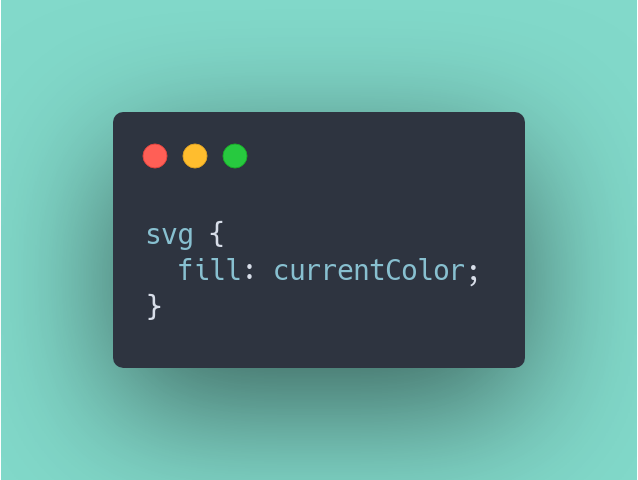
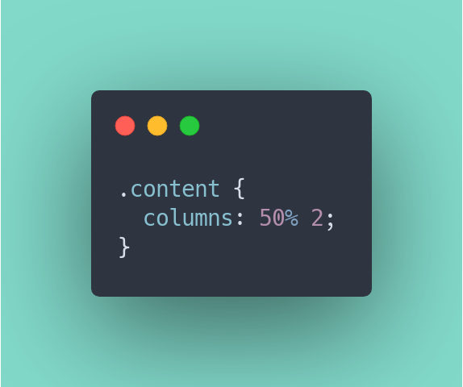
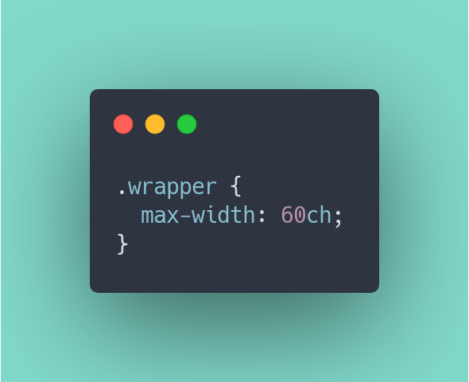
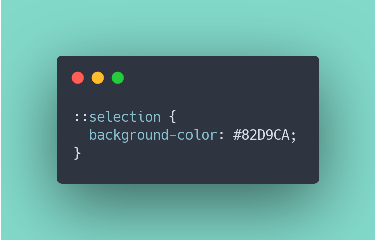
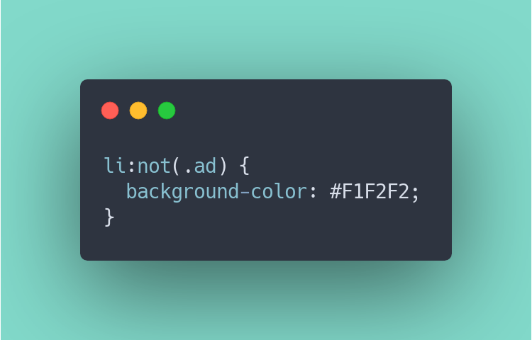

inspired by @insharamin s thread here are 5 more not-so-famous css tips.

🧵👇 

https://xcancel.com/Insharamin/status/1404423505370763269

---

# currentColor
this is like the og css variable. it's set to the current value of the color property.

potential usecase 🤔
color (fill) of svg icons.

reference 🧠 
https://css-tricks.com/currentcolor/

---

# css columns
if you want to layout your text in columns, css can do that (without grid or flexbox): introducing css columns 😉 

🤔 
magazine-like layouts.

🧠 
https://css-tricks.com/almanac/properties/c/columns/

---

# the ch property
works like the em or rem property, but 1ch is equal to the width of one character (the zero).

🤔 
i often use it for the width of textblocks to improve readability (45 – 65 ch).

🧠 
https://css-tricks.com/the-lengths-of-css/#ch

---

# the ::selection selector
with this selector, you can style mouse selections on your page.

🤔 
make the highlight color your brand color.

🧠 
https://css-tricks.com/almanac/selectors/s/selection/

---

# :not selector
only select elements, that don't match a certain selection.

🤔 
style a list and exclude special elements (e.g. ads).

🧠 
https://css-tricks.com/did-you-know-about-the-has-css-selector/

---

that's it ✌️ 
if you've learned something new, consider to retweet the first tweet above, so we can spread the word 📣 😉 

what's your favourite css secret? 👇
