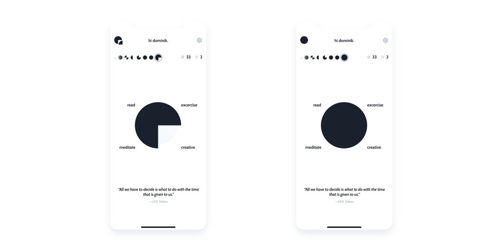

building an app in public. pt I.

the idea.

🧵👇

---

do you know the concept of “non-zero days”?

tldr: 4 rules, one goal. doing one thing every day, that brings you closer to your dream(s).

those rules were created by reddit user u/ryans01 in this now infamous comment: https://www.reddit.com/r/getdisciplined/comments/1q96b5/i_just_dont_care_about_myself/cdah4af/

---

if you want an overview of this philosophy, check out this great video by @AlexanderDeLuca: https://youtu.be/XQQH9ai0xgc

---

there are some apps out there, that use this non-zero day approach. but none of them quite fits me. and that's where my app comes in:

introducing quarta:

---

quarta is a very minimalistic, single-purpose app for tracking your non-zero days. there are only a few features:

---

- define your 4 everyday goals (“quartas”) – e.g. exercise, doing something creative, meditate &amp; read
- check off your quartas and track them
- see your progress history
- streaks for non-zero days and also full days (all quartas done)
- daily reminder (push notification).

---

as i said, really simple but also something i'm gonna use every day. and hopefully, some other people to 😉

---

so, what's the plan?

this is the first “real” app i'm gonna build, so i thought... why not build it in public? and that's exactly what i'm gonna do 😊 

sooo if you want to follow along, just hit that follow button and you're in 😉 

and if you have any feedback, just hit me up!

---

if you're interested in the idea, please consider liking the first tweet. thank you 🙏🏼 https://xcancel.com/dominikhofer_/status/1412720560283418627
