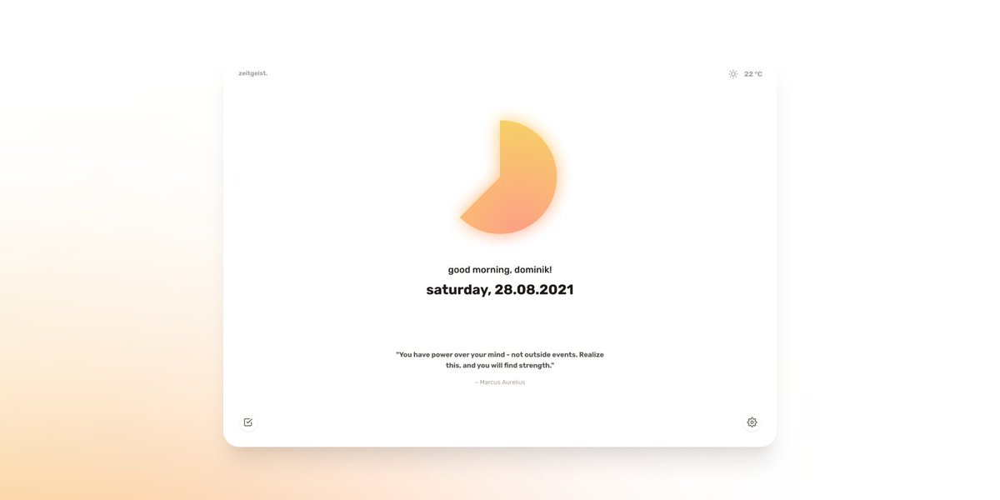
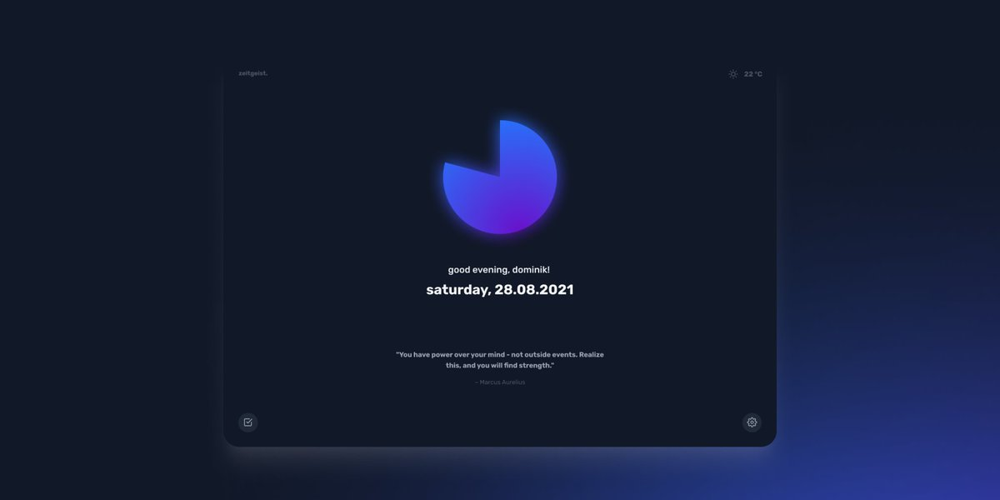
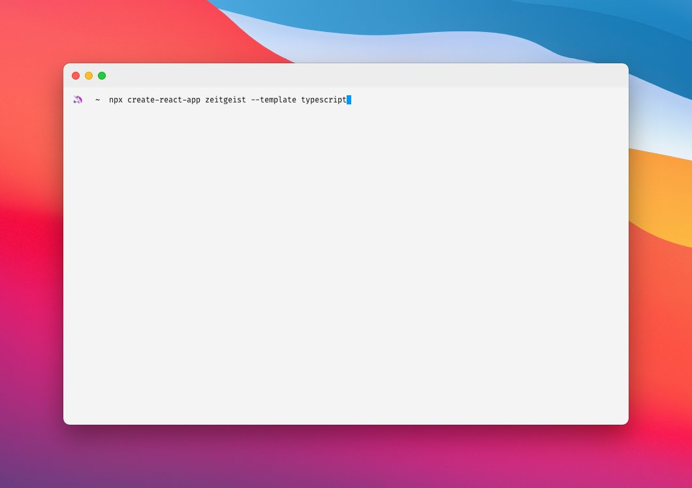

after a few weeks of learning swiftui, i wanted a little break and build something using more familiar technologies.

it's only a small product but something i need for myself :)

i'm going to keep you updated in this thread 🧵 

in the meantime, here's the logo 👀

---

but what is zeitgeist?

essentially, it's a new tab chrome extension with a very minimalistic and beautiful design. it features a daily progress indicator, the current date, a quote, the weather, and a simple task list. additionally, there is a focus mode and a dark mode 🌓

---

here's the design 💅

---

let's gooo ⚛️

---

fetching the weather data and displaying it with a little icon works ⛅️ plus it saves the selected location to localstorage.

---

the data fetching now works via a @vercel serverless function.

*note to self* learn properly what cors actually is...
