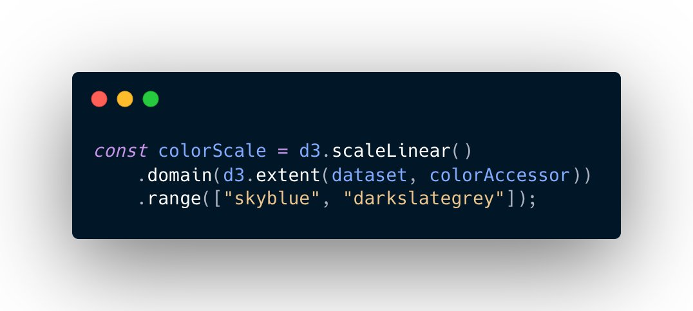

currently going through @Wattenberger's “fullstack data visualization with d3” – here's my first scatterplot 🙌

i especially like the color scale in the plot. it was really impressive to see, how easy you can map numbers to a color range in d3.

---

here's the code that creates the color scale:

