I've always struggled with finishing the projects I started. That needs to change.

So I set myself up for a challenge: Over the course of the next 7 days, I'm gonna plan, design, build &amp; launch my first product!

Follow along in this ongoing thread 👇
(RTs appreciated, thanks!)

---

The idea is pretty simple and has already been living in my public idea scrapbook for a while.

On Youtube, there are many great documentaries &amp; informative videos made by indie creators. But there is no easy way to discover them.

I'm going to fix this.

https://xcancel.com/dominikhofer_/status/1525080456416198658

---

Here's a quick feature brain dump I did with the core features and some additional ideas. 

I didn't specify this before, but I'm going down the #nocode route for this project. So I'll have to see, what's actually possible to implement with the technology I chose.

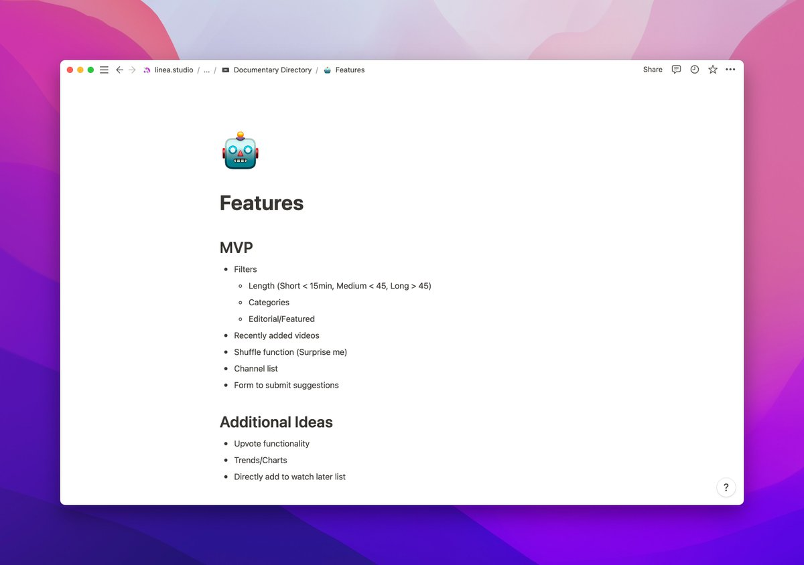

---

✅ name
✅ typeface
✅ logo (a combination of a play button and a star)

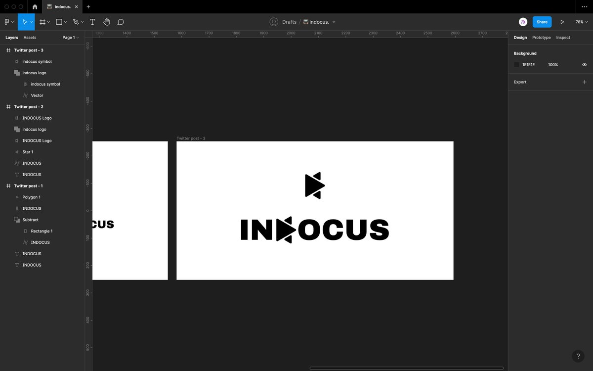

---

Created a little site map and made a few wireframes.

Contrary to my usual design process, I'm not going to jump into Figma now and design the whole website. Reason being, that I don't really know yet, which customization options are available in the tool I'm building this in.

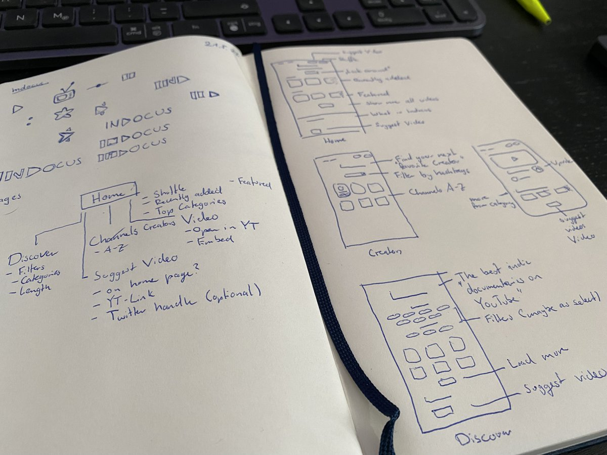

---

So I'm sorta designing while I build, which should be a fun challenge🥳
But the wireframes are definitely a must for every web design, regardless of whether or not you're creating a proper screen design later on.

---

As a cms, I'm using @airtable. Simple, yet powerful to use.

In under an hour, I've set up the whole database. It includes 3 tables and some interesting cross-references between them, which will come in handy later.

Here's what the main table looks like:

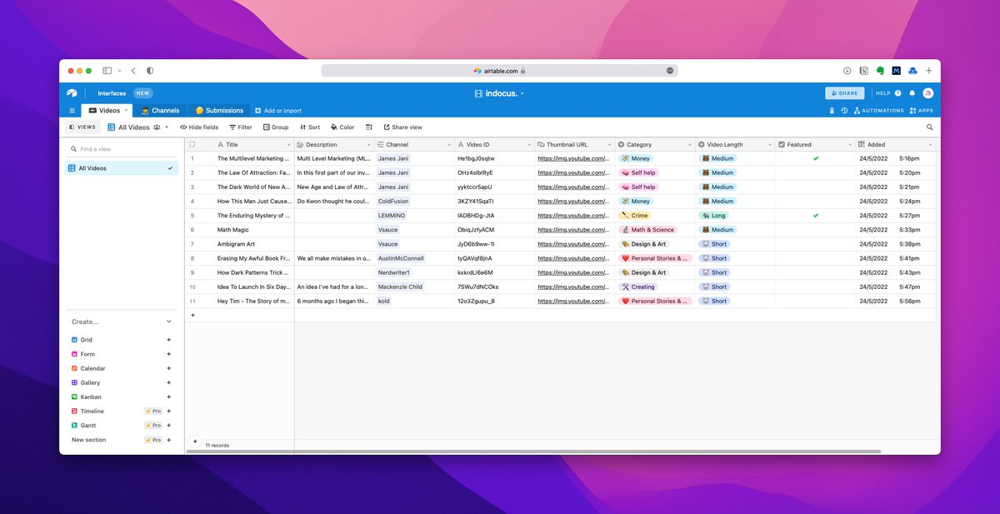

---

@airtable After some research, I've decided that the frontend will be powered by @softr_io 

Haven't used it before but it looks pretty promising. We'll see how it goes.

---

@airtable @softr_io Alright, after like 1.5h, I've already got a simple site setup 👉 https://indocus.softr.app

It's pretty simple right now, but quite impressive what you can create in such a short amount of time. 

Softr is limiting you pretty heavily on the design side, which can be good or bad.

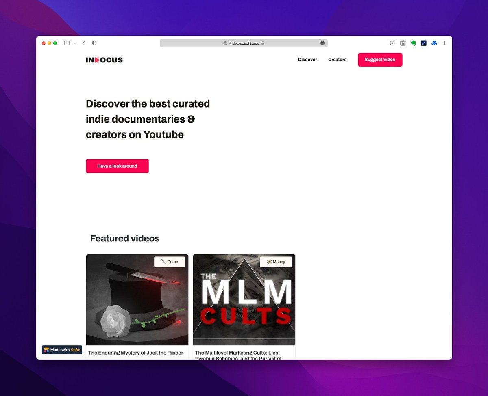

---

@airtable @softr_io Created a little 3D hero image in @splinetool ✨

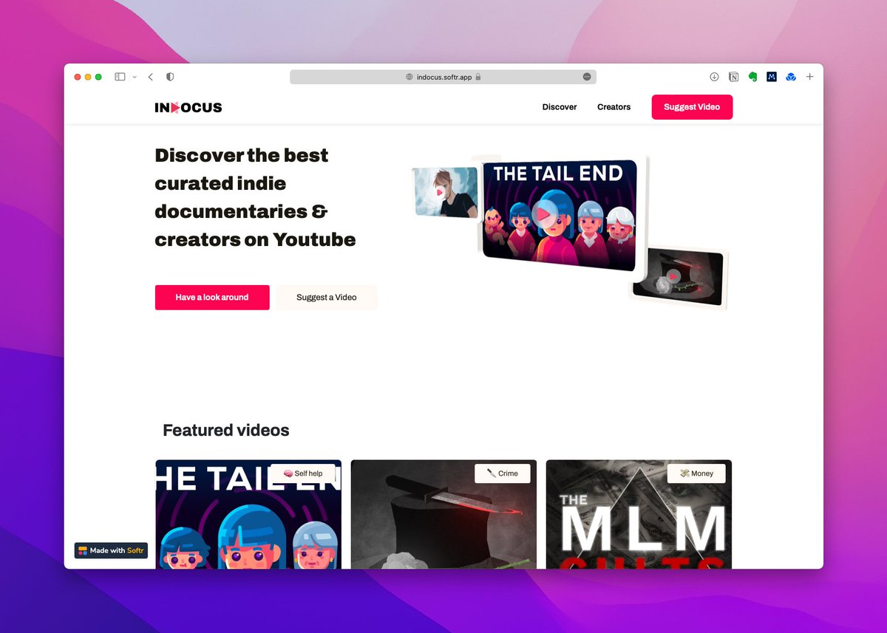

---

@airtable @softr_io @splinetool The site itself is ready, now I just have to add more Youtube videos.

If you know some great indie documentaries, send them my way. Would be greatly appreciated 😁

---

Took longer than I expected, but now, I have a database with nearly 50 high-quality Youtube videos. I'm gonna stop here as I think that's enough for the launch.

My hope is that it gets some traction and people submit their own favorites, so the selection is a bit more diverse.

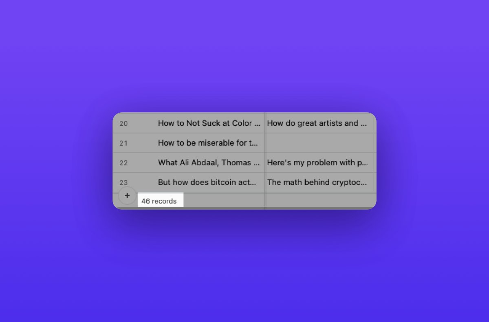

---

I think this is the first time that I've bought the domain after completing the project.

Progress I guess 😂

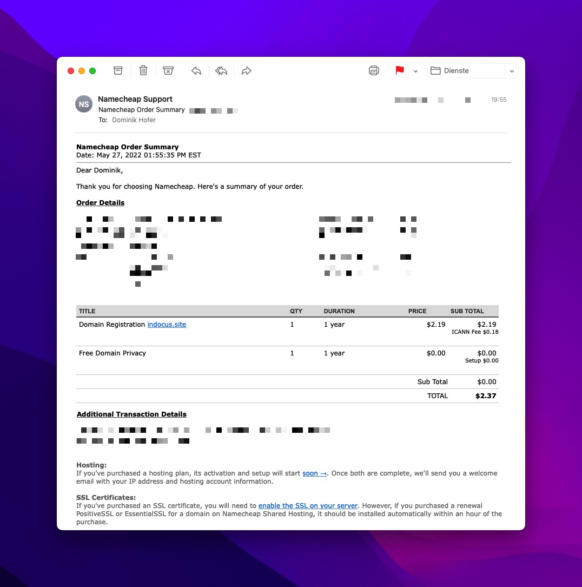

---

Finished the last steps before preparing the PH launch:
✅ Connected domain
✅ Added Google analytics
✅ Added a cookie banner

---

Scheduling my first @ProductHunt launch.

Shit's getting real!

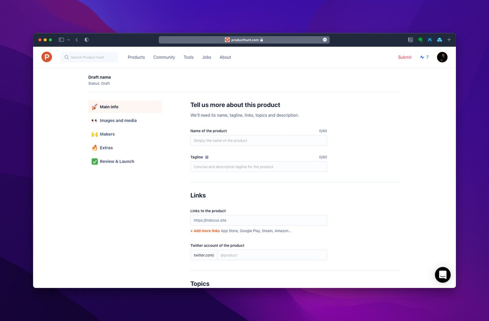

---

✅ ready before deadline. whoop whoop 🥳

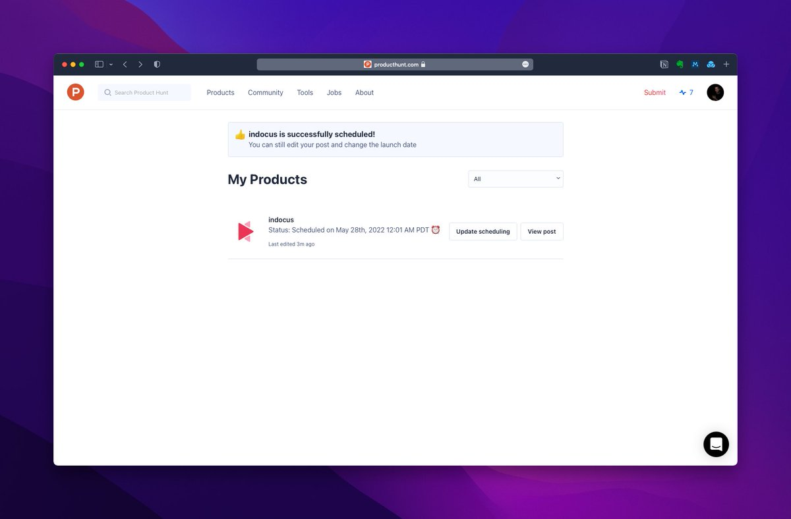

---

If you want to check out the product before the launch, it's available at http://indocus.site

Let me know what you think!

And don't forget to support me tomorrow on Product Hunt 🙌

---

Quick after launch update:

We finished with 36 upvotes 🥳 Quite happy with it since I didn't do any crazy marketing. Was a great experience and I learned a lot for my next launch.

But the best feeling is definitely, that I finally launched something in the first place 🙈

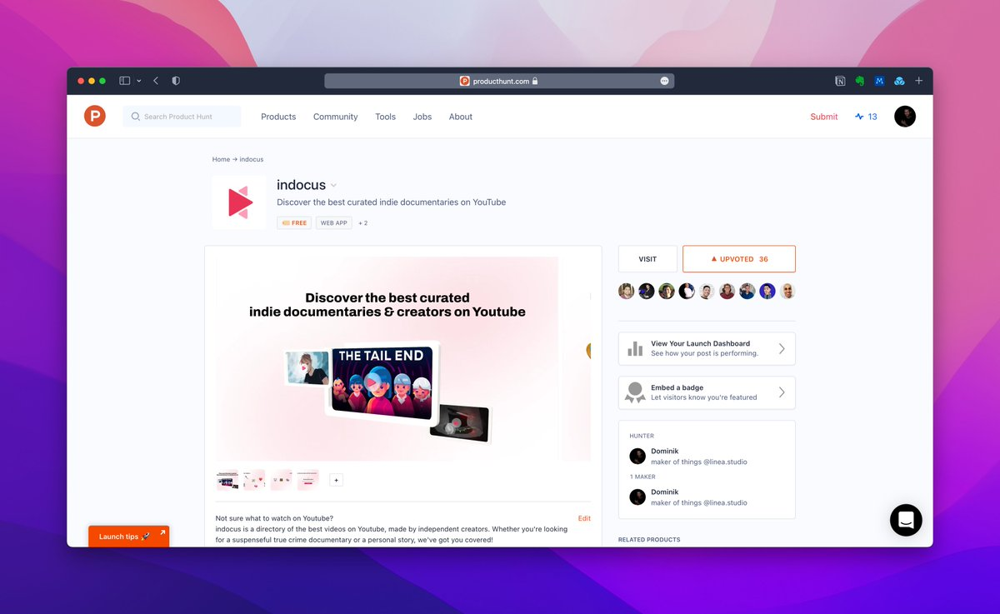
