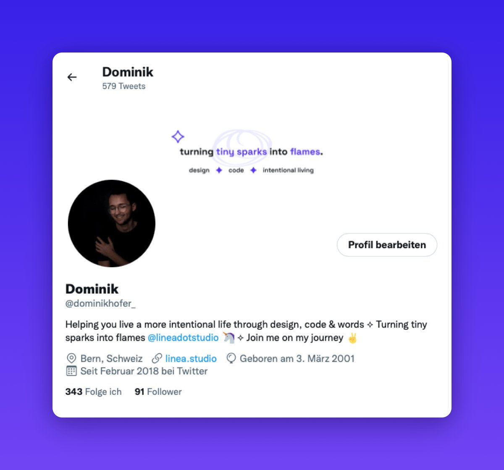

99% of people (me included) use Twitter as a consumer, very few as a creator.

I wanted to change that for myself, so I took the course “From consumer to creator” by @AlexLlullTW &amp; @AlexMaeseJ 

Here are my five main takeaways and what I think about the course:

---

@AlexLlullTW @AlexMaeseJ 1.
The most important step: Change your mindset regarding Twitter.

See yourself as a creator and think like one. Focus on constantly delivering value.

The Twitter game is a marathon, not a sprint.

---

@AlexLlullTW @AlexMaeseJ 2.
Find out, what your niche is. What you stand for.

It has to be something you're truly passionate about and where you are in a unique position.

Setup your Twitter profile accordingly (profile pic, banner, bio, pinned tweet).

Learn more 👇
https://xcancel.com/david_perell/status/1259539005097426944

---

@AlexLlullTW @AlexMaeseJ 3.
Make a habit out of writing down your ideas. Be a collector.

And don't waste them by only posting them once. Recycle your ideas: Restructure them, add something to them, you name it.

Also important: Consume great content.

---

@AlexLlullTW @AlexMaeseJ 4.
Engagement &gt; Followers

Connections are everything. They generate opportunities.

So focus your time mostly on interacting with people. Especially in the beginning. Add something to the conversation.

9/10 of your tweets per day should be replies.

---

@AlexLlullTW @AlexMaeseJ 5.
Who to interact with:

– Top players in your niche
– People who are where you want to be in 6 months
– People in a similar stage as you
– Your audience

Use lists for this.

---

@AlexLlullTW @AlexMaeseJ I'm going to start using the learnings from the course one by one. 

For example, I just changed my banner and my bio. What do you think?

---

@AlexLlullTW @AlexMaeseJ As you can see, I'm very happy that I took this course. Here's what I liked most about it:

– Bite-sized lessons, timeboxed to 1h
– Many personal insights from the creators
– Video screencasts
– Many examples (do's &amp; dont's)

⭐️⭐️⭐️⭐️⭐️

---

@AlexLlullTW @AlexMaeseJ If you also want to go from consumer to creator, definitively check out the course and support the creators! It's a steal for 30$.

👇
https://alexllull.gumroad.com/l/consumer-to-creator

---

If you want to help me on my journey to become a creator, consider following me. I tweet about minimalist design, building tiny products, and living a more intentional life.

Also, consider liking &amp; retweeting the first tweet. Thanks for being awesome ✌️

https://xcancel.com/dominikhofer_/status/1532760371034849280
