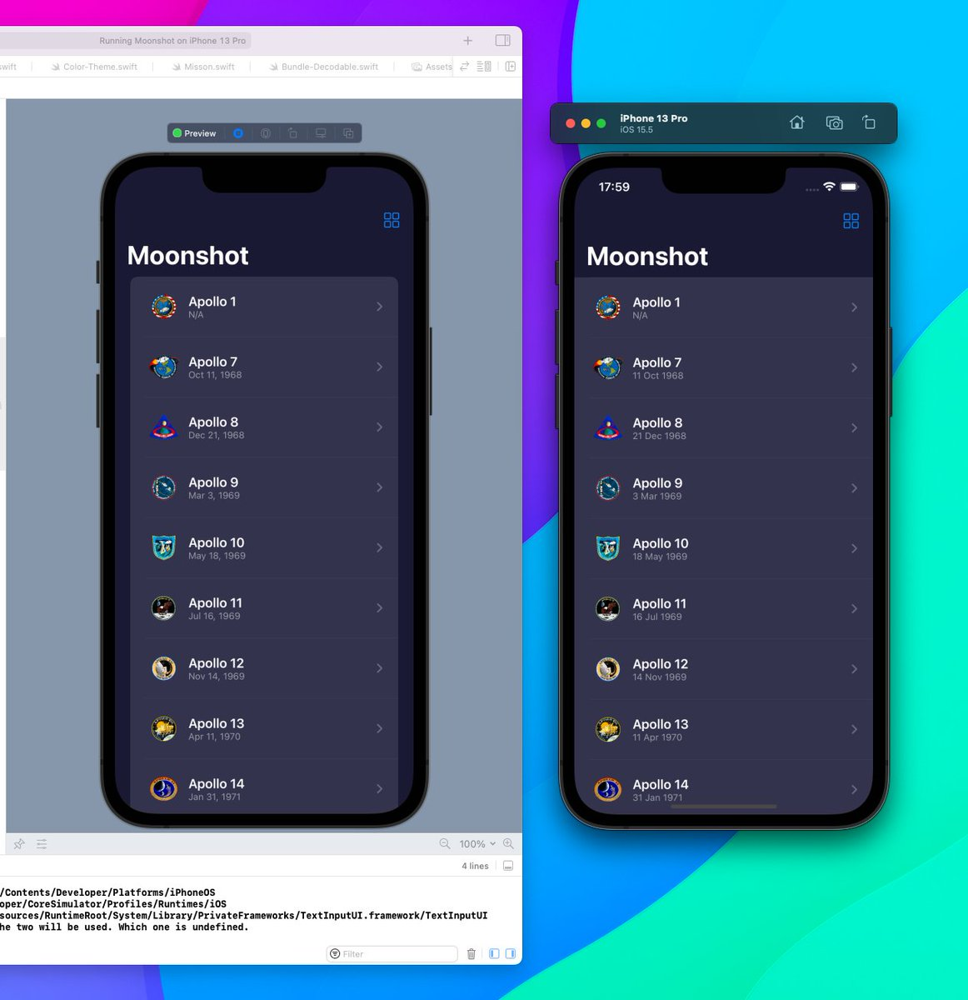

Quick SwiftUI tip:

I struggled to figure out how to change the background of a list in SwiftUI.

Turns out, you need to use the .onAppear modifier 👇

---

If you want to style individual rows, use .listRowBackground()

---

You can also use .listStyle(.plain) which allows you to then set a custom background color. However, this changes the appearance of the list (full width).

See comparison (left: regular, right: plain) 👇

