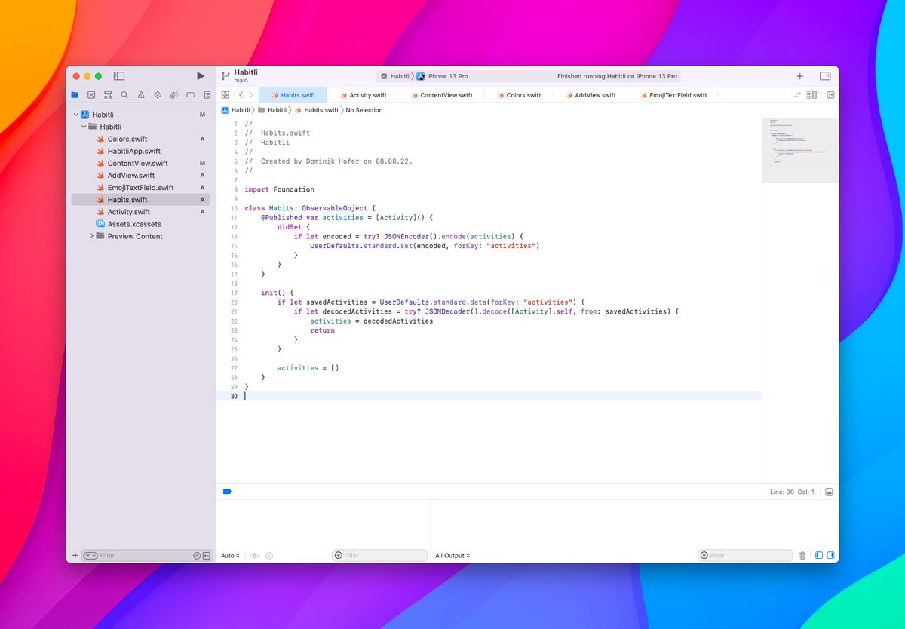
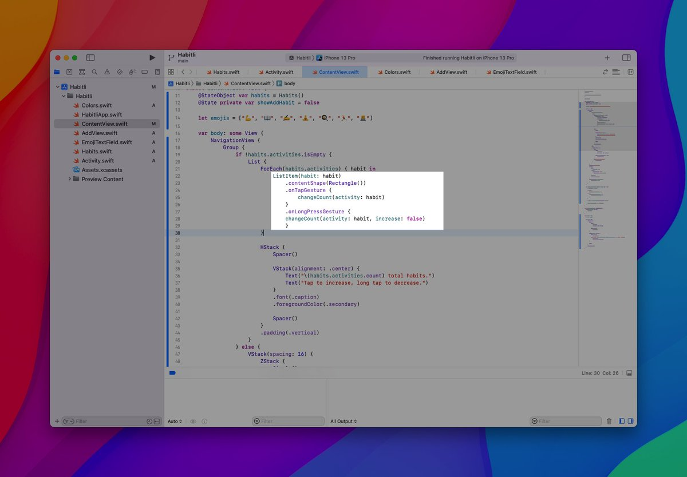
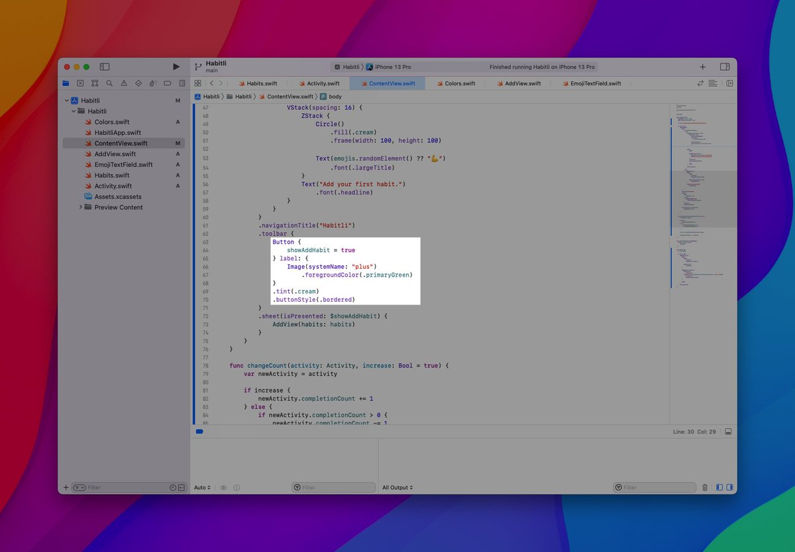
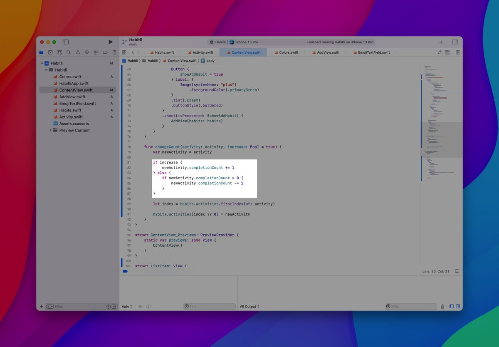
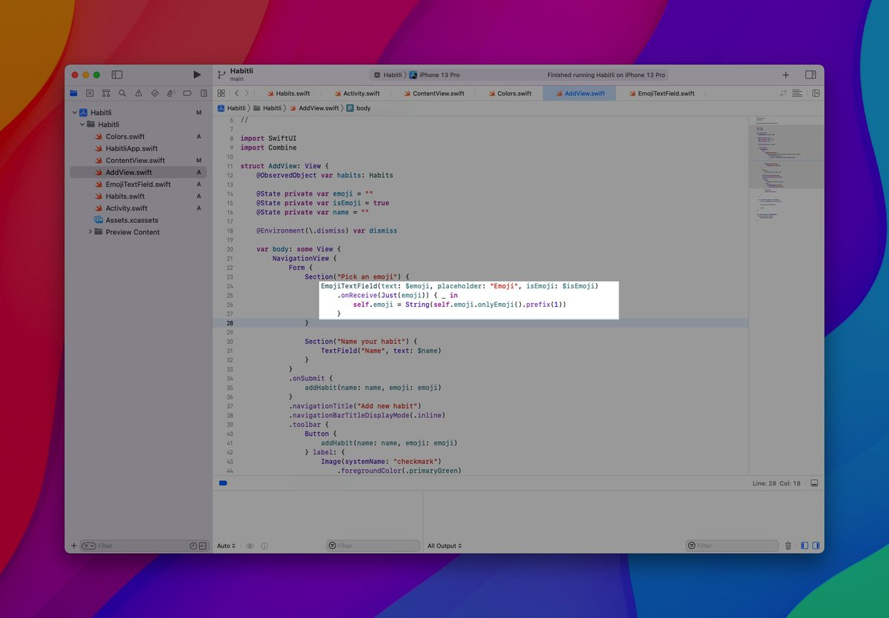

Day 47 #100DaysOfSwiftUI

✅ Created the simplest habit tracker ever

This was the first app that I completely built by myself that is actually useful. Impressive, I know 😉

Will probably add a few features if I have time the coming days.

Read on for a few behind the scenes 👇

---

How to save &amp; retrieve data from UserDefaults.

Keep in mind, that this is probably not the most ideal solutions for bigger datasets…

---

Use .contentShape(Rectangle()) to make the whole list item tappable (including the spacer).

Make sure to use .onTapGesture before .onLongPressGesture, otherwise, the first one gets ignored.

---

Use .tint to style bordered buttons.

---

Try to create somewhat “smart” functions that can be used for multiple purposes. But don't overdo it as well…

---

Create a simple, custom emoji picker that only accepts one emoji as input (you can't enter any other characters).

Here are the two StackOverflow answers I used:
🔗 https://stackoverflow.com/questions/66397828/emoji-keyboard-swiftui/66397959#66397959
🔗 https://stackoverflow.com/questions/66397745/how-to-make-sure-that-only-emoji-can-be-entered-in-the-textfield-swiftui/66398629#66398629

---

That's it, thanks for reading until here 🙌

Any ideas for features, that I could add?
