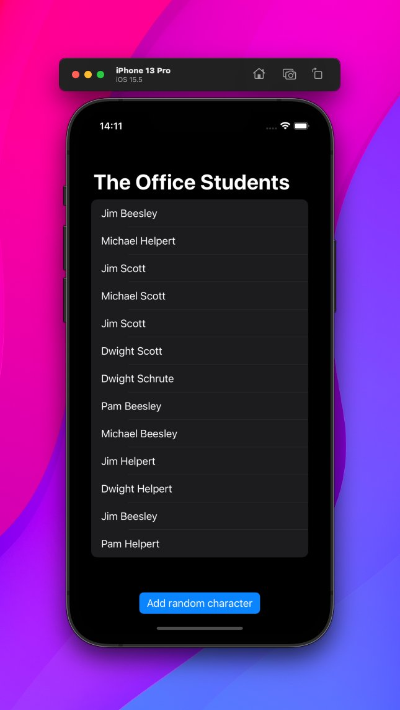

Day 53 #100DaysOfSwiftUI

✅ Overview of the Bookworm project

🔑 takeaways:
👉 @ Binding for changing values in other views
👉 TextEditor for multiline text fields
👉 Intro to CoreData

I feel like with some CoreData skills, I'll finally be able to create my own real apps 🥳

---

Also, if you're wondering why I'm always using The Office gifs…

I'm currently watching the show and am obsessed haha 😍

I even made todays exercise project a random name generator for half-fictional Office characters:

