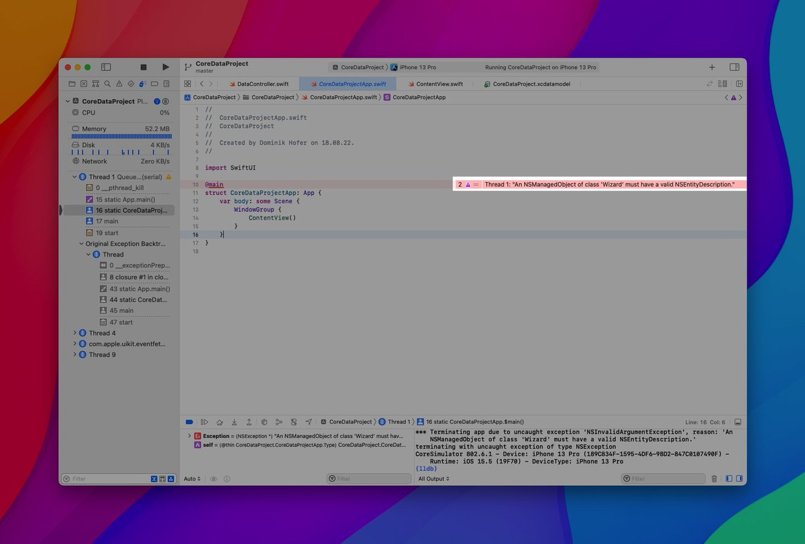

Day 57 #100DaysOfSwiftUI

✅ Deep dive into CoreData (part I)

🔑 takeaways:
👉 .self refers to the whole object → computes hash value
👉 Create a NSManagedObject subclass to handle optionality in one central place
👉 Check if changes were made to the moc
👉 NSMergePolicy

---

However, I got this weird error while following the last video. Tried different solutions from SO but none of them worked…

Anyone have a clue, what could be the problem?

cc @twostraws

