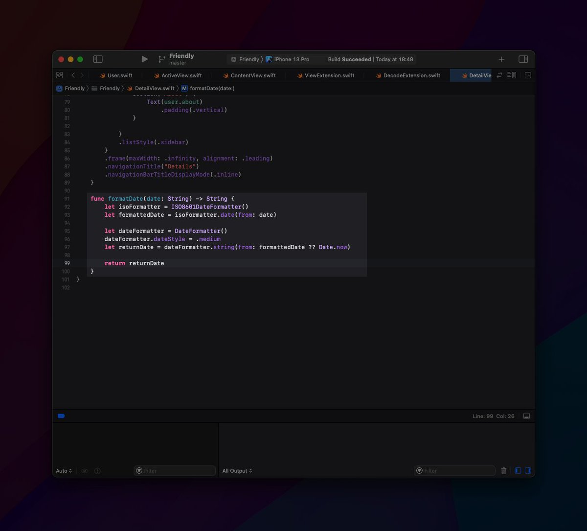
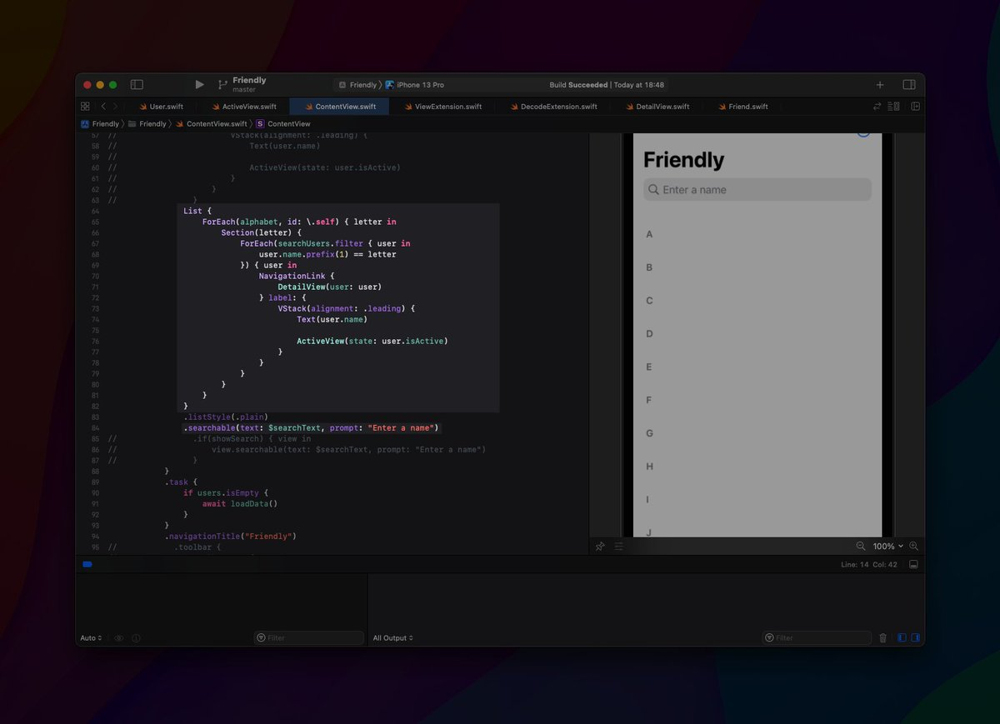

Day 60 #100DaysOfSwiftUI

✅ Created a personal CRM app

This app was not that hard UI-wise, but quite a challenge to get all the data stuff correctly.

Definitely not perfect, but solid I think :)

Read on for a few behind the scenes 👇

---

To decode the JSON directly from the server, I've used this handy extension:

https://www.hackingwithswift.com/quick-start/concurrency/how-to-download-json-from-the-internet-and-decode-it-into-any-codable-type

---

Formatting the date from an ISO-string was actually quite more complex than I thought it would be.

Here's the solution, that I landed on:

---

Adding search to a list however, is simpler than it seems.

Also see how I managed to do the separate sections per letter:

---

Here is how you can make a list filterable as well:



---

If you want to take a look at the code, here you go:

https://github.com/hfrdmnk/hacking-with-swiftui/tree/master/Friendly

Feel free to send me improvement suggestions!
