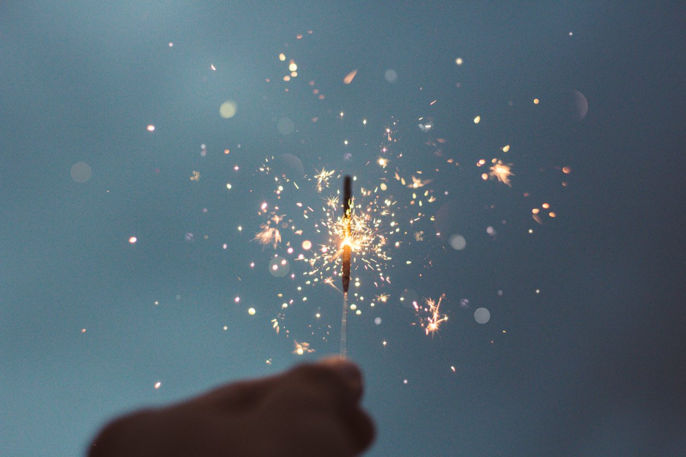
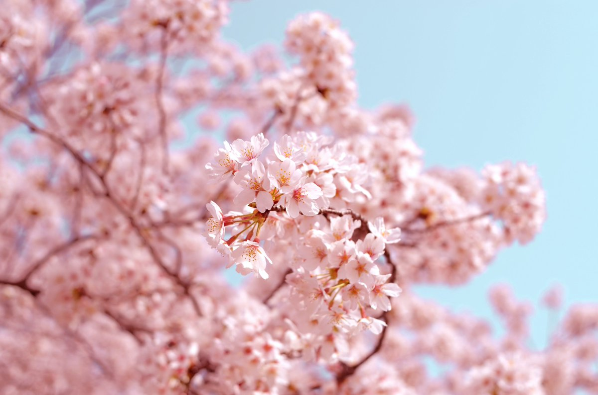
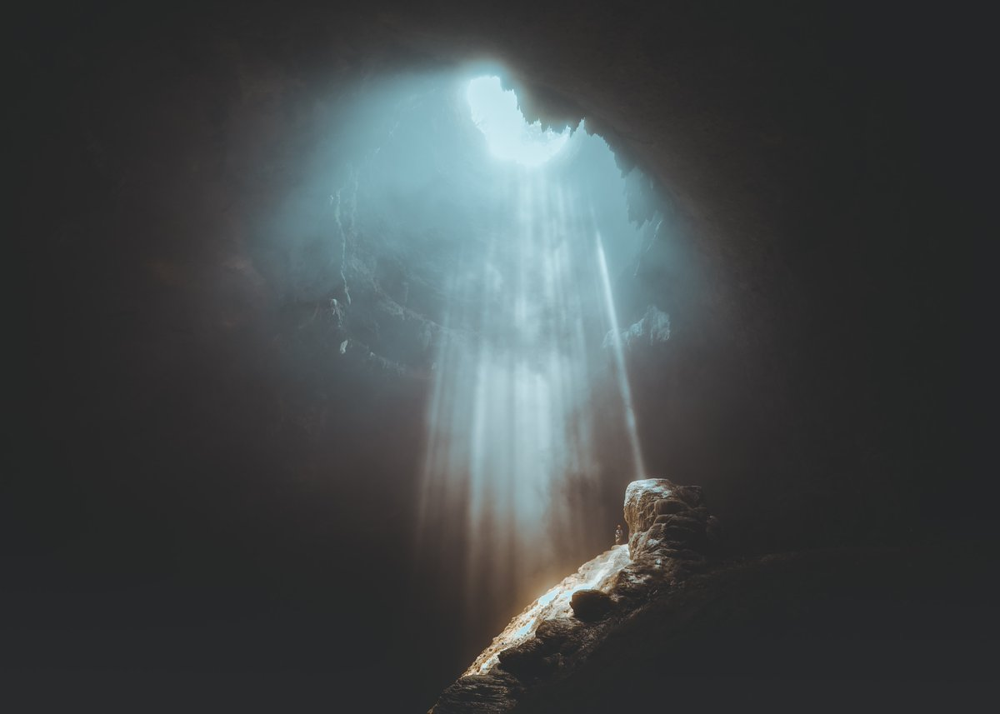
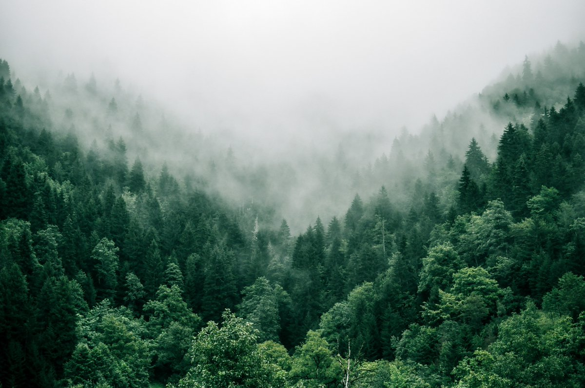
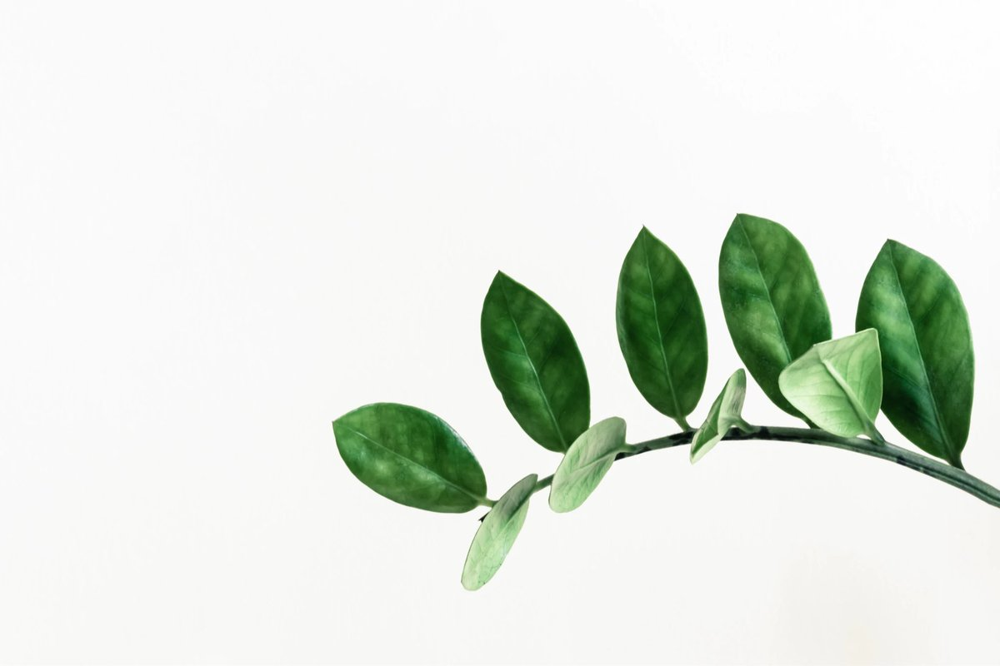

Beautiful words.

(An ongoing thread:)

---

Spark.

An ignited or fiery particle such as is thrown off by burning wood or produced by one hard body striking against another.

---

Nostalgia.

A wistful desire to return in thought or in fact to a former time in one's life, to one's home or homeland, or to one's family and friends; a sentimental yearning for the happiness of a former place or time.

---

Blossom.

The state of flowering.

---

Sunrays.

Rays of sunlight.

---

Nebulous.

Hazy, vague, indistinct, or confused.

---

Essential.

A thing that is fundamental or necessary.

---

Authenticity.

The quality of being real or true.

