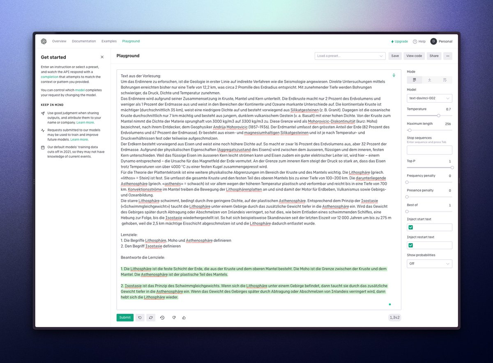

#GPT3 is just out of this world. And I might have an idea to make the studying part of my school life (mostly summarizing/making flashcards) much, much easier…

👇

---

So here's my current workflow:

1. I read the required chapters in the respective school book
2. I try to understand as much as possible/summarize
3. I make flashcards based on the learning goals and put them in Remnote to learn with spaced repetition

---

Now comes the awesome part 🤓

This whole process can (most certainly) be completely automated with @OpenAI's GPT-3!

---

1. Enter all the text from the textbook (in chunks)
2. Let GPT-3 summarize the text for a 10-year-old, so you understand things better
3. Answer the learning goals so I'm able to copy them into Remnote

Here's a quick test (in german):

---

This is soo impressive!

(The parameters can be tweaked to optimize this even further – if you have some knowledge with GPT-3, please hit me up 😁)

I think this is an idea definitively worth pursuing.

What do you think?
And has something similar been done before?
