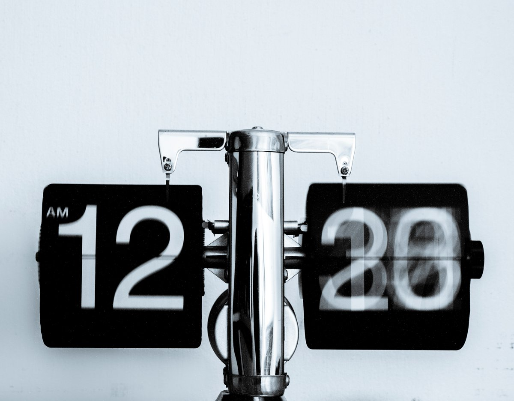
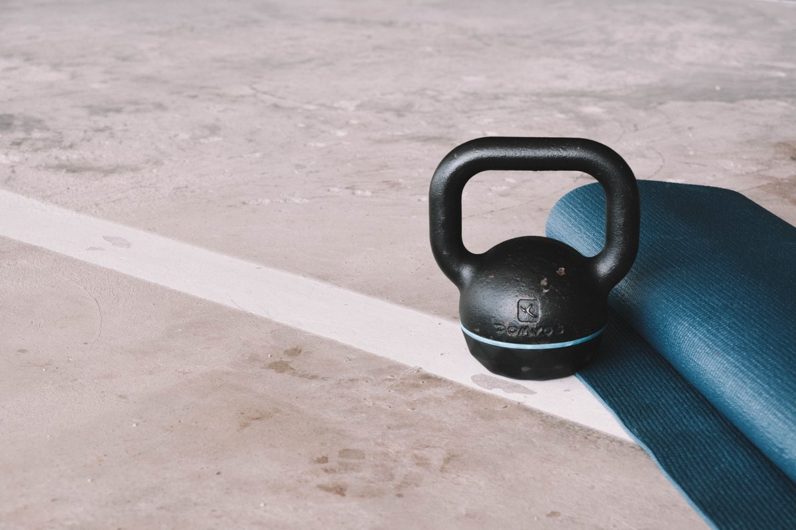

10 life principles to live by:

---

1. Be kind to others and also yourself.

---

2. Always prioritize time over money.

---

3. Never save on health, knowledge and gifts.

---

4. 80:20 your life as much as possible.

---

5. Consume to create.

---

6. Don‘t drink calories but more water.

---

7. Sleep more than 7 hours every night.

---

8. Exercise everyday.

---

9. Learn something new everyday.

---

10. It‘s ok to not be ok, things will get better.

---

That’s a 🌯 – hope you've found this thread helpful.

Follow me @dominikhofer_ for more content on design, code &amp; living a more intentional life.

Like/Retweet the first tweet below if you can – and stay awesome ✌️ https://xcancel.com/dominikhofer_/status/1580290959933202432

---

You can read the unrolled version of this thread here: https://typefully.com/dominikhofer_/UouawaV
