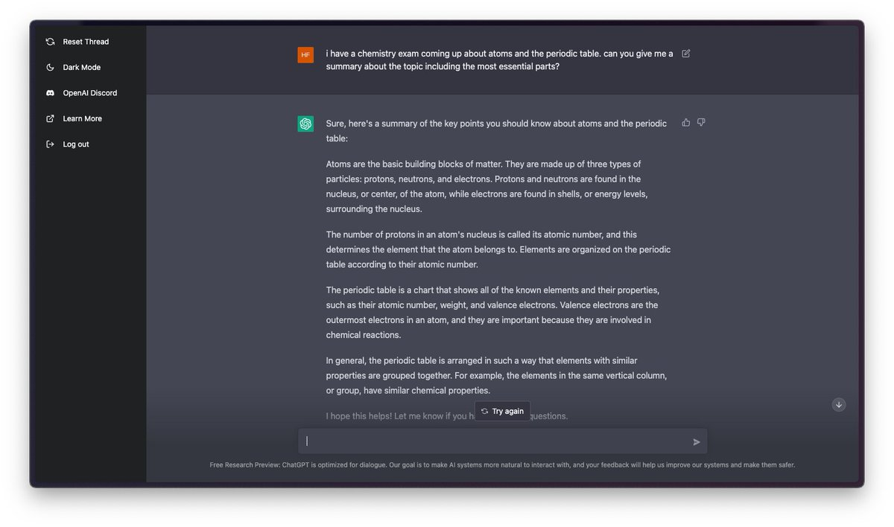
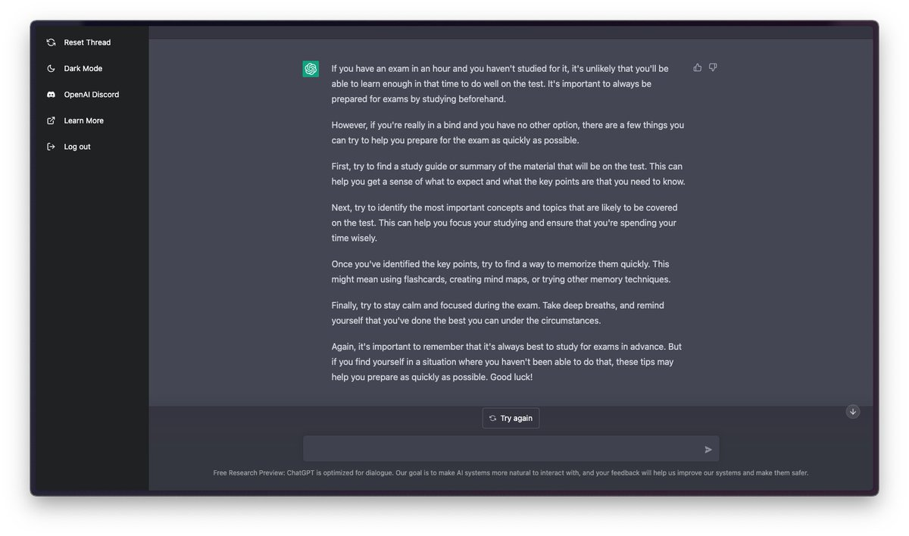
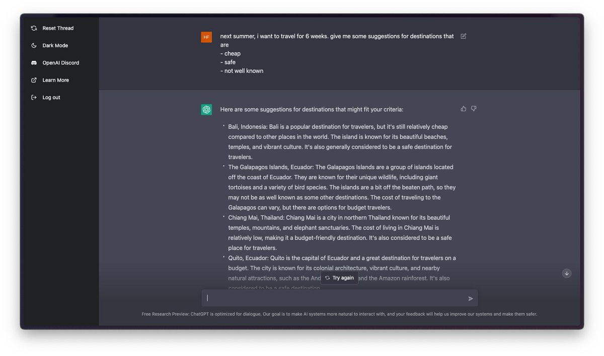
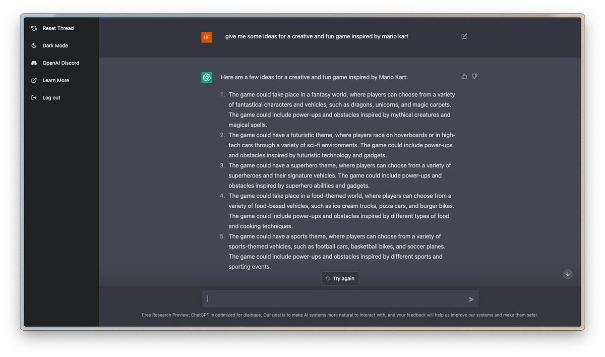
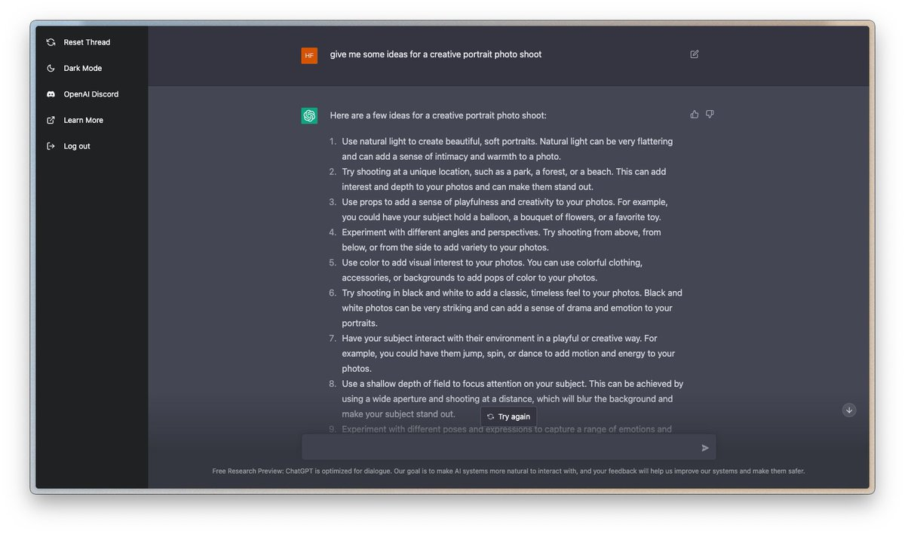
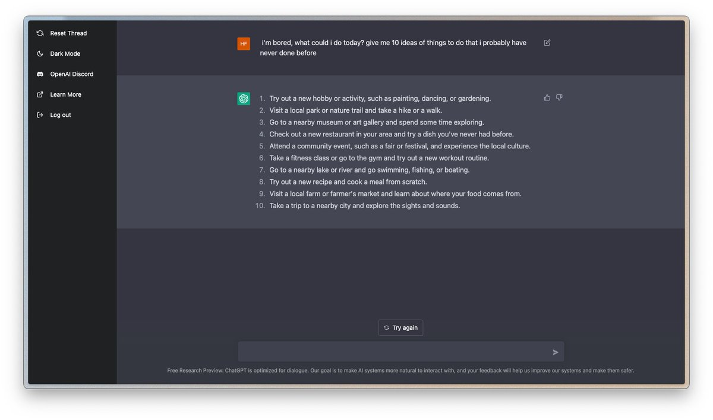

So, you might have heard about ChatGPT, the new product by the company behind the great GPT-3, @OpenAI.

I've been using it for a few days now and I'm constantly impressed by its capabilities.

Let me show you some cool stuff and interesting information  🙌

---

Tldr; if you're interested in AI and natural language processing, you have to try ChatGPT. It's a fascinating glimpse into what the future of technology might look like.

---

Talking to ChatGPT is like talking to a smart (and I mean really really smart) friend. It feels very natural and the bot understands the context of the conversation.

This finally makes this technology accessible to everyone, since the GPT-3 playground can be quite overwhelming…

---

Another great thing about ChatGPT is that it can be trained to specialize in specific areas of knowledge or expertise. This makes it even more useful for a wide range of applications.

Let me give you some examples:

---

For students:

Auto-generate summaries and flashcards.

---

For lazy students:

Getting tips for studying for an exam one hour before it starts.

---

For lifelong learners:

Explaining topics in simple terms.

---

For people in a relationship:

Generating ideas for Christmas gifts.

---

For people not in a relationship:

Coming up with a funny Tinder caption.

---

For makers:

Generating ideas for side projects.

---

For coders:

Helping with code questions.

---

For party animals:

Suggest creative party ideas.

---

For travelers:

Generating ideas for unique and off-the-beaten-path destinations.

---

For writers:

Brainstorming ideas and getting feedback on writing.

---

For content marketers:

Generating ideas for blog posts.

---

For artists:

Coming up with creative drawing or painting ideas.

---

For game devs:

Suggesting fun and challenging game ideas.

---

For new parents:

Generating ideas for fun and educational activities for children.

---

For photographers:

Suggesting creative photo shoot ideas.

---

For Instagrammer:

Choosing appropriate captions &amp; hashtags for posts.

---

For people that want to have a laugh:

Suggesting funny jokes.

---

For solo founders:

Save time on customer requests.

---

For every person:

Generating an infinite amount of ideas for literally everything.

---

Attention, meta use case ahead!

For me:

Helping me write this thread 😁

---

This is just a glimpse of what is possible with ChatGPT. Keep in mind that these tasks could be optimized as far as you want just by telling the model what you want exactly.

The sky is truly the limit here.

---

Try it out for yourself. Today.

🔗 https://chat.openai.com/chat

---

Although this thread was written with the help of ChatGPT, it still took a lot of time to write and put it together. So a like/retweet of the first Tweet would be highly appreciated :)

Follow me @dominikhofer_ for more.

Cheers ✌️ https://xcancel.com/dominikhofer_/status/1599472994933358593

---

You can read the unrolled version of this thread here: https://typefully.com/dominikhofer_/S0mUGjW
