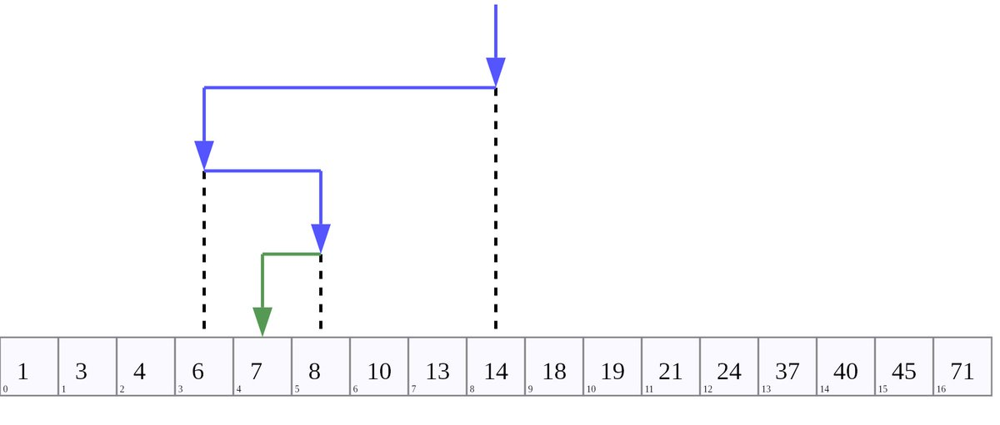

#CS50 002  

Introduction to algorithms and Scratch. 

The most interesting thing for me was to see how an algorithm can become much more efficient by taking more creative approaches → see binary search algorithm 👇

---

The binary search algorithm is a technique to find an item in a sorted list.

You take a look at the middle item and then look at the middle item of the half that contains the item. Repeat until the item is (hopefully) found.

Image credit: Wikipedia

