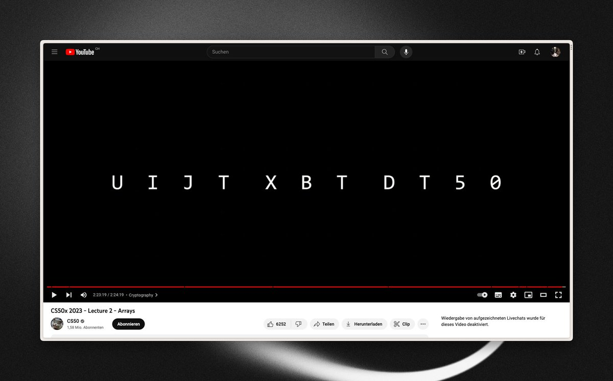
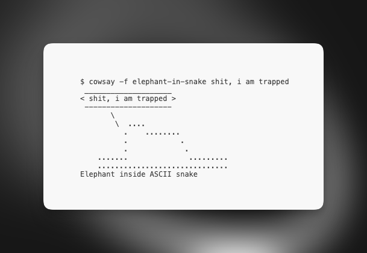

#CS50 013

Finished lecture 2 – Arrays

Things are ramping up a bit, but still very comprehensible and interesting. It was really satisfying to see, how the puzzle pieces began to click together towards the end of the lecture.

Curious, what the problem sets are about 👀

---

Also kudos to @davidjmalan for coming up with probably the most creative and rewarding ending of a lecture I have ever seen 👏

---

I also encourage everyone to read more about the cowsay program: https://en.wikipedia.org/wiki/Cowsay

Programming history can be so weird but I am here for it :D

