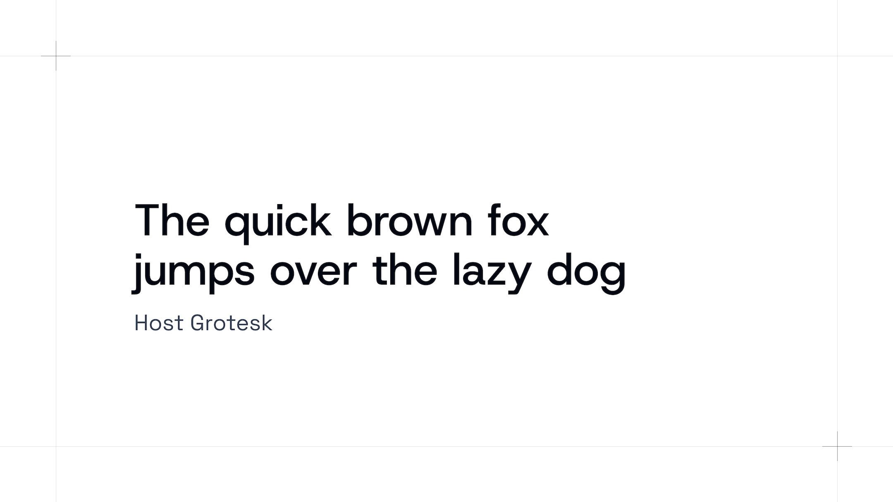
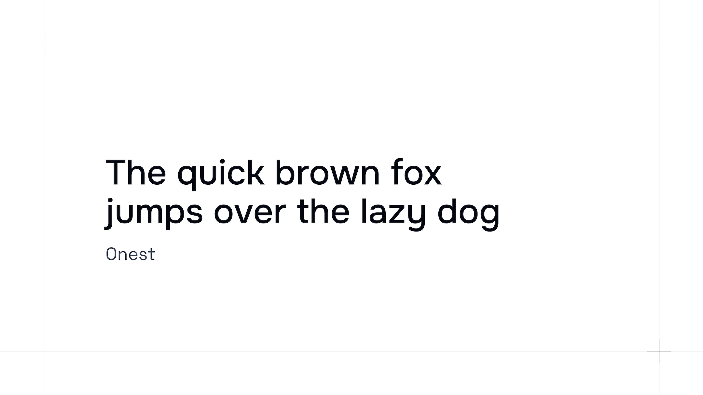
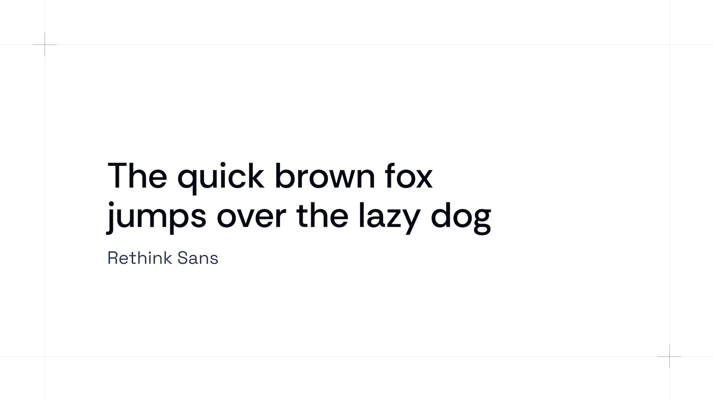
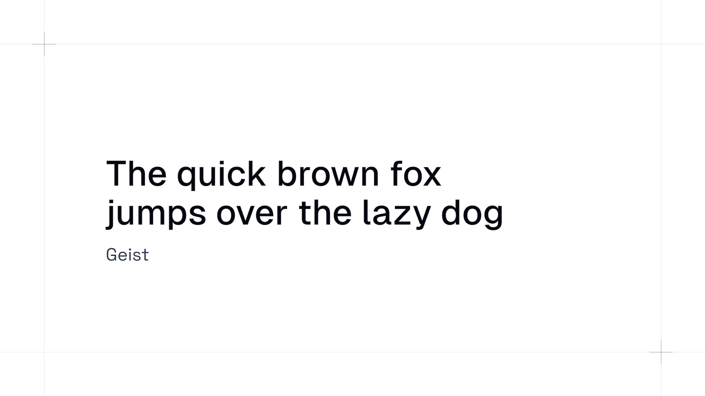
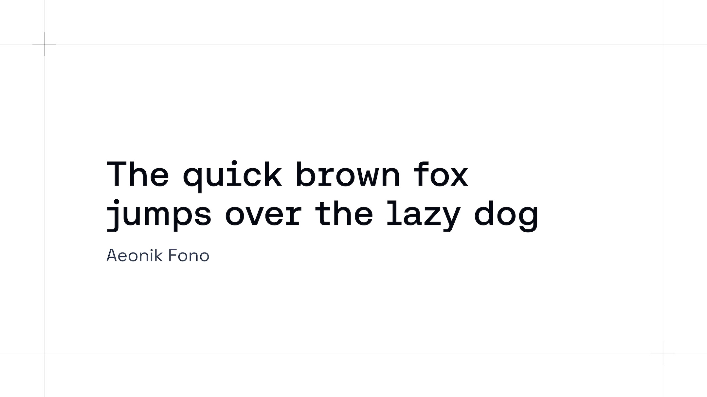
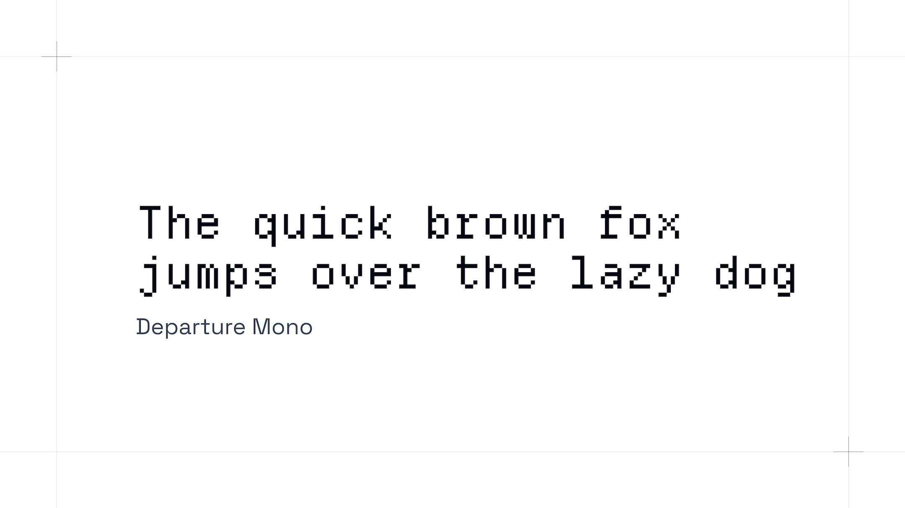
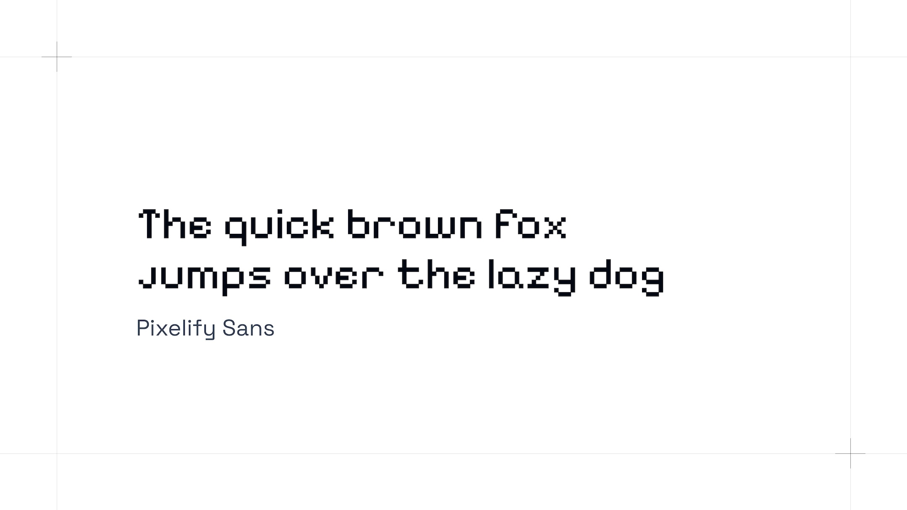

I’m currently on and off designing and building v2 of this website. Along the way, I’ve been looking for some fonts that I could use for my new branding.

As a future reference for me and hopefully as inspiration for you, I wanted to share some of the gems I found:

## Host Grotesk

A beautiful sans-serif font that works very well for headings. I like that it has a very geometric feel while still featuring some interesting and “sharp” details like the descenders for j and y. The lowercase a looks beautiful as well, kinda like a loop. 

It is based on Poppins (which explains why I like it so much) but not nearly as overused – let’s hope it stays that way.

Specimen: [https://elementtype.co/host-grotesk/](https://elementtype.co/host-grotesk/)

Alternatives to Host Grotesk that I also consider great sans-serif options for headings are:

## Onest

Specimen: [https://fonts.google.com/specimen/Onest](https://fonts.google.com/specimen/Onest)

## Rethink Sans

Specimen: [https://fonts.google.com/specimen/Rethink+Sans](https://fonts.google.com/specimen/Rethink+Sans)

## Geist

Geist is made by Vercel and thus already very popular. It’s a great all-rounder font that I like to substitute for [Inter](https://rsms.me/inter/), since it’s still not as widely used as the latter. There is also a Mono version, which is a plus.

Specimen: [https://vercel.com/font](https://vercel.com/font)

## Aeonik Fono

This is a font I immediately fell in love with. It is based on the [Aeonik](https://cotypefoundry.com/our-fonts/aeonik) font made by the same type foundry and, as the name hints at, is a hybrid between the sans-serif and the mono version. I like beautiful sans-serif fonts, I like mono fonts – this feels like a match made in heaven. 

Only “downside” for me right now is that it’s paid, so it’s not gonna be used on my personal website. But I’ll bookmark it for future budgets with bigger budgets :)

Specimen: [https://cotypefoundry.com/our-fonts/aeonik-fono](https://cotypefoundry.com/our-fonts/aeonik-fono)

## Departure Mono

A font straight out of a flight ticket. I’m really digging this aesthetic right now, possibly because of my usage of [FocusFlights](https://apps.apple.com/us/app/focusflight-deepfocus-timer/id6648771147)[^1]. It obviously doesn’t fit every design, but when it does, it gives it that special ✨extra✨.

Specimen: [https://departuremono.com/](https://departuremono.com/)

An alternative with a similar vibe would be:

## Pixelify Sans

Specimen: [https://fonts.google.com/specimen/Pixelify+Sans](https://fonts.google.com/specimen/Pixelify+Sans)

If you happen to know other great fonts that are not that widely used, please let me know!

[^1]:	I’ll probably write a review someday but for now, just trust me when I say this, it’s my app highlight of the year and you should download it as well ;)
