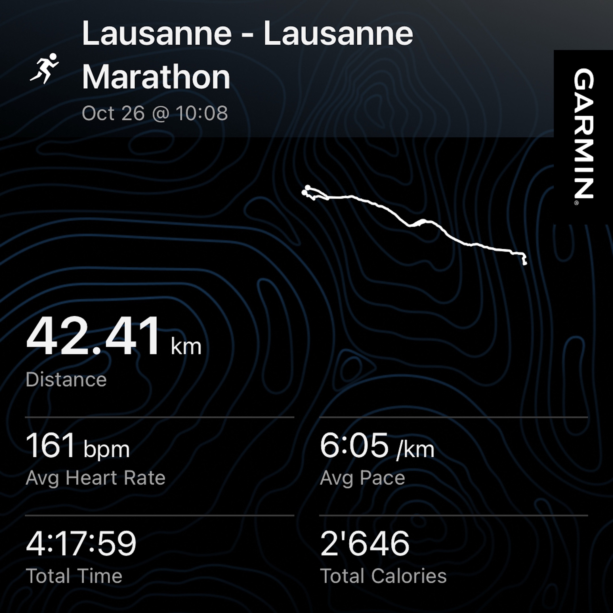
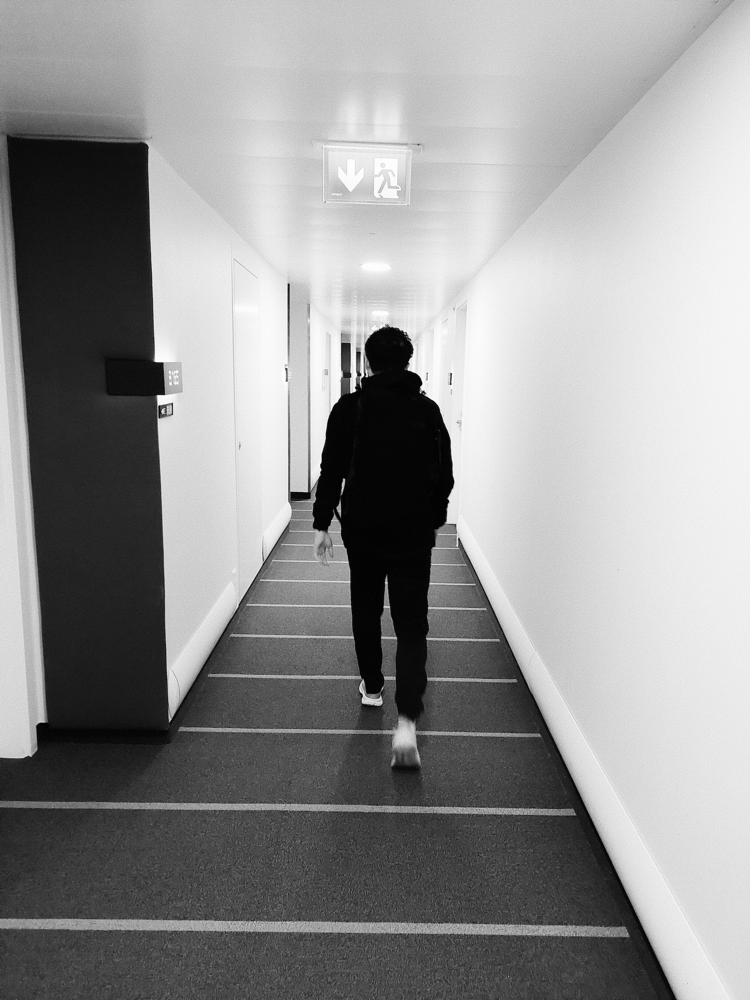

Yesterday, I participated at the Lausanne Marathon – my first-ever race at that distance. Now, on the day after the big event, I want to recap a bit and write about my experience. For future me and maybe for you as well, if you’re interested and perhaps even want to run a marathon yourself.

## The result

First things first, I actually finished the marathon! This was my primary goal and I achieved it, which feels great.

My secondary goal was to finish with a sub 4h time. As you can see, I didn’t manage to do that (the official chip time was 4:18:01). But after having completed the whole distance and knowing the pain I went through, this almost feels like an afterthought. At least it wasn’t close, and I didn’t have to stress myself out on the last couple of kilometers.

As I crossed the finish line, I was just happy that I pushed through and that now, all the pain, all the doubts, all the struggles were over, and I was finally able to rest. My family was there to support me, and seeing them again meant so much to me. This is a moment that nobody can take away from me, and that I will remember and cherish forever.

## The prep

As the saying goes, the true marathon is all the training you do to be able to compete in the race. The marathon in the end is just the reward for all the hours spent on the tracks the months before.

To give you a glimpse into my training, here are some details:

I ran the whole year and raced at various events. But the true marathon training started on June 24th, so 18 weeks ago. Since then, I have…

- …completed 59 runs, 2 of which were 10k races…
- …which took me almost 65 hours…
- …and made me cover 634 km.

Apart from the summer vacation in Scandinavia, I followed the plan almost without fail. The longest long run at 30k took place roughly a month before the race. It’s kinda fascinating how I grew to enjoy these long runs, and how a 16k one suddenly felt like it wasn’t that long.

I also trained most of my time in zones 1 and 2, which was a bit of a weird feeling in the beginning. When I prepared for 10k races in the past, I usually had way more speed sessions in the plan, so I had to adjust a bit to the lower paces.

The week of the race, I unfortunately didn’t feel that great and was afraid that I would get sick. My HRV decreased quite a bit, but maybe that was also due to the nervousness. Luckily, though, I stayed healthy and felt confident that I could run the race.

## The race

At the start line, I felt awesome. And on the first few kilometers, that feeling proved true: Everything felt easy, and I was able to settle into a good rhythm. The weather was great, a bit cloudy but not rainy, and the temperature was very comfortable. The whole course ran along the shore of Lake Geneva and made for a very picturesque view.

Around the half-marathon mark, though, I felt some fatigue creeping in, and I had to slow down my pace a bit. But since I had run the first half quite a bit faster than anticipated (I was roughly 1 km ahead of my planned pace), I just ran the next couple of kilometers almost exactly at the pace my Garmin was suggesting. At this point, I was still ahead of the 4h pacer. But I already felt that the way until the finish line would be a very long one.

Right before the 30k mark, though, I slowed down quite dramatically and a couple of hundred meters later, I had to walk a few steps for the first time. At that point, I was seriously doubting how I would be able to ever run another 12 kilometers until this whole thing was over. It wasn’t a problem with my cardiovascular system (no problem there whatsoever, my HR stayed quite even during the entire race), but my legs just completely shut down. This was also roughly the spot where the 4h pacer caught up and overtook me. So I knew that the goalposts had now shifted, and the goal was just to finish the race.

I felt that there wasn’t a possibility that I could ever run all the way to the finish line. So I switched to another strategy: Whenever my Garmin alerted me that another kilometer had passed, I was allowed to walk 100 meters. And then run another 900 meters until the next kilometer mark. It was just me against my head who told me to just stop and my legs who felt like they would just quit by themselves if I didn’t do it. Only the next step mattered. Step by step toward the finish line – nothing more, nothing less.

So the saying that the marathon race really starts after 30 kilometers is definitely true. If I had to tell you what defined this race for me, these were the exact moments that do it justice. I was overwhelmed by all the feelings and thoughts I had but also by the sheer kindness of the strangers who supported us all by cheering, shouting our names, holding up motivational posters, high-fiving, handing out snacks, and one man even helping me refill my water bottle.

This whole time, apart from wanting to finish the race, I only had one goal in mind: I wanted to be able to run the last kilometer in full without any walking breaks. And let me tell you, this was certainly the longest kilometer of my life. But as the finish line came in sight, I was even able to pick up the pace a tiny bit and cross it without any regrets. Realizing at that moment that I had just completed my first marathon was one of the best and most overwhelming feelings I ever felt.

## Lessons learned

In hindsight, there are obviously a few things that I could have done better. Here is what I would do different the next time:

### Really prioritize a negative split

I now know that feeling great on the first half of the race is not at all an indicator of how the race will unfold. So even if the starting pace of the pacer feels “too slow”, there is a reason why you should run a marathon in a negative split (i.e., running the second half faster than the first).

### Focus more on nutrition

I already took nutrition way more seriously than in my other races, but there is still some room for improvement. For example, I couldn’t take my last gel because I felt like I was going to puke afterward. So having some sort of carbohydrate-drink on me would have been a good idea. Also, I didn’t explicitly carb-load the week before, which might also have contributed to my muscular fatigue.

### Completing a marathon by itself is a big achievement

My longest race before this one was a half-marathon, the longest run ever was that 30k from the training plan. I really underestimated what these last 10 – 12 kilometers demand from your body. So for a next marathon, I would allow myself to just enjoy the race more without focusing so much on my pace.

## What’s next

Yesterday evening, I was glad that I experienced finishing a marathon but was also quite sure, that I wouldn’t ever do this to myself again voluntarily. Why would I?

But today, despite having the heaviest legs ever, the world already looks a bit different. I’m not committing to anything concrete yet, but I will say this much: This probably wasn’t my last marathon.

A big thank you to everyone who supported me on this journey \<3
