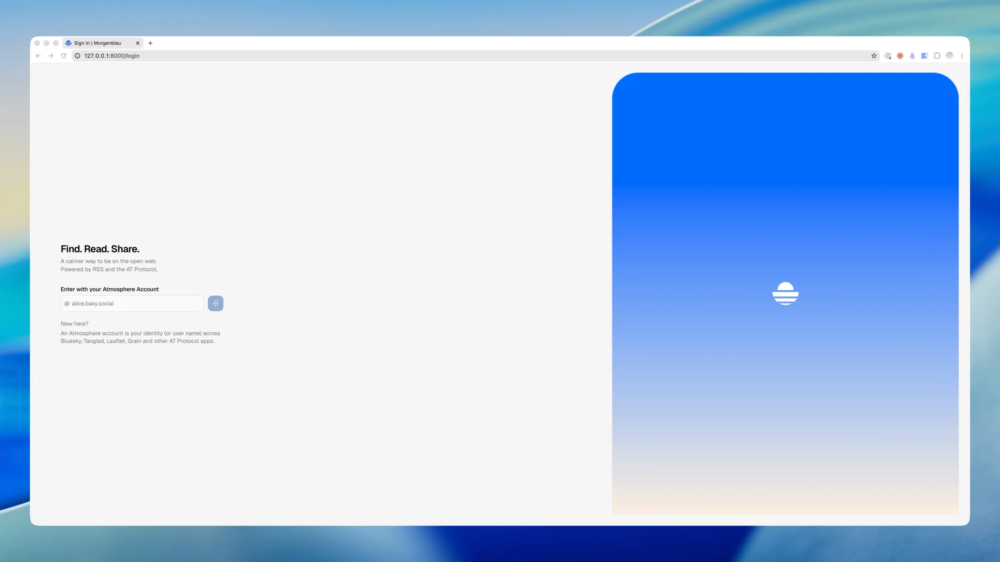
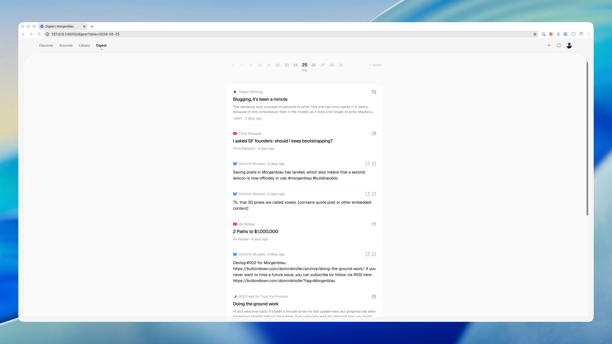
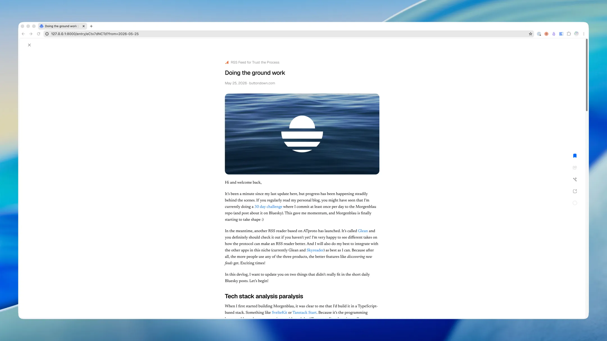
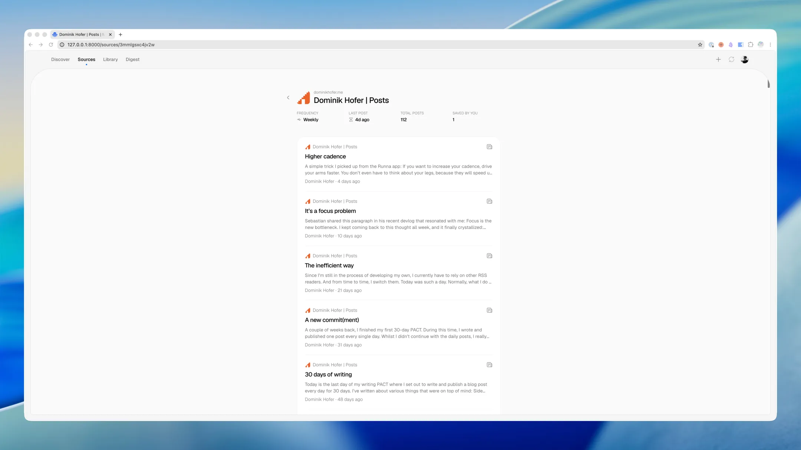

Last Tuesday, I completed [my latest PACT](/a-new-commitment): Committing at least once a day to the [Morgenblau repo](https://tangled.org/dominik.social/morgenblau) (the RSS reader I’m building) and posting about it over on [Bluesky](https://bsky.app/profile/dominik.social) for 30 days.

Whilst I’m nowhere near a finished product, I did make significant progress:

- Moved off TanStack Start to Laravel + React
- Eventually also moved off Laravel to the current stack: Go + React (mainly for the better ATproto package ecosystem)
- Built the pipeline that fetches feeds
- Added the “add subscription” flow
- Designed and created the minimal reader view
- [Published my own ATproto lexicon](https://lexicon.garden/identity/morgen.blue)
- …and so much more

As you can see, progress was not really linear (sometimes even circular). But I enjoy the state the app is in right now, including the new Go-based stack. There is still polish waiting to happen, but I can definitely see the vision of my own social RSS reader coming to life.

Of course I will continue working on Morgenblau and updating you on how it’s going (just maybe not daily). The best way to keep up to date with the development is to [subscribe to my newsletter](https://buttondown.com/dominikhofer?tag=Morgenblau) (via email but also RSS of course) where I post devlogs that go a bit more in-depth.

To close this PACT, here are a couple of screenshots of the current version of Morgenblau:

